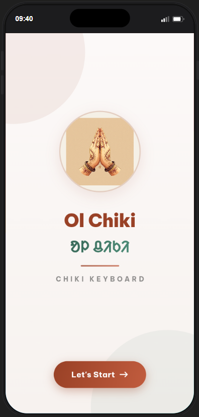
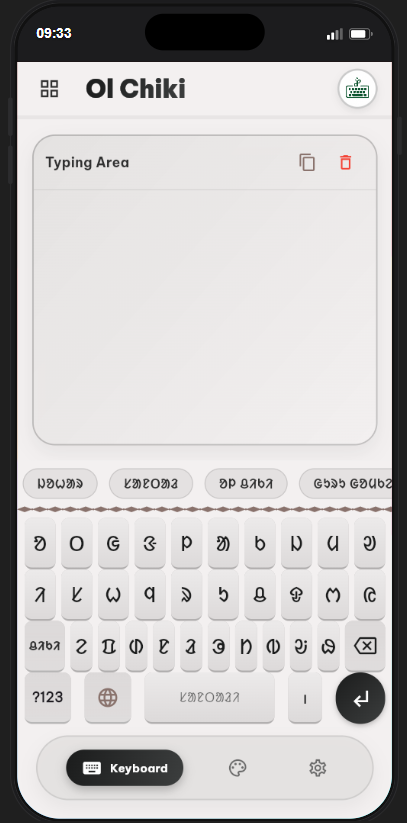
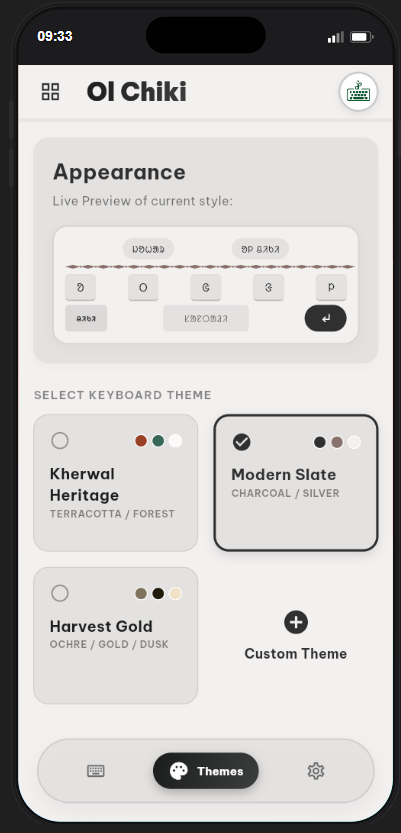
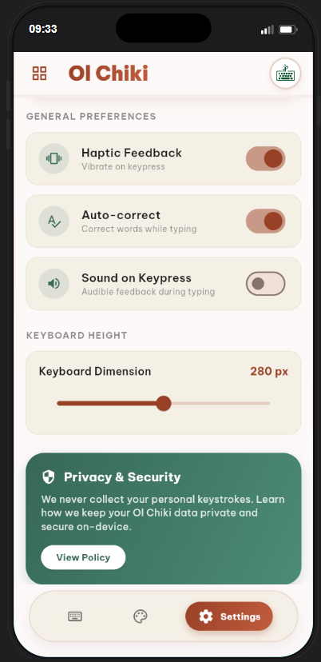

# 🎨 Ol Chiki - Santhali Keyboard

A modern, feature-rich, and privacy-focused Android Input Method Editor (IME) for the Santhali Language (Ol Chiki Script) built with Flutter.

[](https://flutter.dev)
[](https://android.com)
[](https://opensource.org/licenses/MIT)
[](http://makeapullrequest.com)

---

## 🎥 Demo Video

Here is a quick demonstration of the keyboard in action:

<p align="center">
  <video src="assets/screenshots/demo.mp4" width="320" controls muted autoplay loop></video>
</p>

---

## 📱 App Screenshots

Here is a look at the application interface:

| Welcome Splash | Keyboard Typing Area | Appearance Themes | Advanced Settings |
|:---:|:---:|:---:|:---:|
|  |  |  |  |

---

## ✨ Features

*   **Dual Layout Support:** Effortlessly switch between the traditional **Ol Chiki (ᱚᱞ ᱪᱤᱠᱤ)** script and standard English layouts.
*   **Smart Suggestions & Prediction:** Offers intuitive text suggestions in both Santhali and English to boost typing speed and accuracy.
*   **Visual Themes & Personalization:** Choose from pre-configured themes like *Kherwal Heritage* (Terracotta & Forest), *Modern Slate*, and *Harvest Gold*, or build your own custom look.
*   **Tactile Haptic Feedback:** Enhanced touch responsiveness with physical vibrations on keypress (fully adjustable).
*   **Custom Keyboard Sizing:** A user-friendly slider to dynamically modify the keyboard height (dimension) to match any hand size.
*   **Privacy & Security First:** 🛡️ Zero data collection. All keystrokes, personal dictionary modifications, and typing patterns are processed completely offline, strictly on-device. No telemetry, no network calls.

---

## 🛠️ Tech Stack & Requirements

*   **Framework:** [Flutter SDK](https://flutter.dev) (`>= 3.44.0`)
*   **Script Support:** Noto Sans Ol Chiki Font integration for native script rendering.
*   **Core Packages:**
    *   `shared_preferences` - Local storage for settings & theme presets.
    *   `flutter_colorpicker` - Custom theme builder.
    *   `google_fonts` - Typography rendering.

---

## 🚀 Getting Started

### Prerequisites
Make sure you have Flutter installed and configured on your machine. You can verify this by running:
```bash
flutter doctor
```

### Installation

1.  **Clone the Repository:**
    ```bash
    git clone https://github.com/InterstellerAsh/Santhali_Keyboard.git
    cd Santhali_Keyboard
    ```

2.  **Navigate to the Flutter Project & Fetch Dependencies:**
    ```bash
    cd santhali_keyboard
    flutter pub get
    ```

3.  **Run the App (Debug Mode):**
    Ensure an emulator is active or a physical device is connected via ADB:
    ```bash
    flutter run
    ```

### 📦 Building Release APK

To generate a production-ready split-APK for different CPU architectures (which optimizes app size):
```bash
flutter build apk --split-per-abi
```
The output APKs will be located at `build/app/outputs/flutter-apk/`.

---

## 🛡️ Privacy Policy & Permissions

We value your privacy:
*   **No Network Permission:** The app does not request internet access (`android.permission.INTERNET` is not used), ensuring zero possibility of data leakage.
*   **Keystroke Privacy:** We do not track, upload, or analyze what you type. All data stays strictly on your local device.

---

## 🤝 Contributing

Contributions are what make the open source community such an amazing place to learn, inspire, and create. Any contributions you make are **greatly appreciated**.

1. Fork the Project.
2. Create your Feature Branch (`git checkout -b feature/AmazingFeature`).
3. Commit your Changes (`git commit -m 'Add some AmazingFeature'`).
4. Push to the Branch (`git push origin feature/AmazingFeature`).
5. Open a Pull Request.

---

## 📄 License

Distributed under the MIT License. See `LICENSE` for more information.

---

## 👨‍💻 Created By

**Ashish** (InterstellerAsh) - Feel free to connect!
